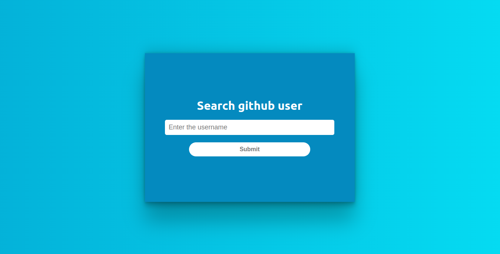
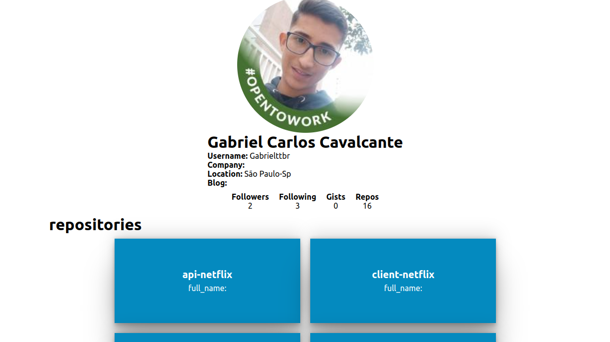

# Aplicação (100%) componentizada

Esse projeto foi desenvolvido em react, onde consumo a API do Github,
tentando deixar o mais componentizada possível, e de fácil manutenção.

site: https://gabrielttbr.github.io/GITHUB-CONSUMINDO-API/

## Telas 

### Pesquisa de usuário

### Página de exibição 



## API GITHUB

    *User: https://api.github.com/users/${username​​}
    *Repositories: https://api.github.com/users/${username}


## Como rodar

Você precisa ter o [Node](https://nodejs.org/en/), o [Git](https://git-scm.com/) e algum gerenciador de pacotes([NPM](https://docs.npmjs.com/downloading-and-installing-node-js-and-npm/) | [Yarn](https://classic.yarnpkg.com/lang/en/docs/install)) instalados em sua máquina.

``bash
1. Clone o repositório:
$ git clone https://github.com/Gabrielttbr/GITHUB-CONSUMINDO-API.git
2. Acesse a pasta raiz do projeto e instale as dependências via terminal:
$ yarn / npm install

3. Inicie a aplicação em modo de desenvolvimento:
$ yarn start / npm run start

4. O servidor será aberto em http://localhost:3000
```